# Topologia 

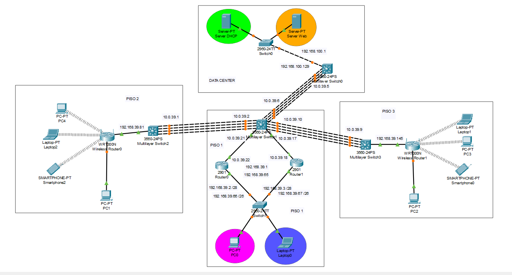

# Vlan

Nombre             | Vlan
-------------------|---------------
ADMIN              |  13       
ESTUDIANTES        |  23    
WEB_SERVERS        |  33    
DHCP_SERVER        |  43    


## Tabla de VLANs (Edificio de Ingeniería)

| Nombre VLAN      | ID VLAN          | Subred            | Gateway         | Máscara            | Rango de IPs útiles           | Hosts |
|------------------|------------------|-------------------|-----------------|--------------------|-------------------------------|-------|
| ADMIN            | 13      | 192.168.39.0/28    | 192.168.39.1     | 255.255.255.240    | 192.168.39.2 - 192.168.39.14    | 14    |
| ESTUDIANTES      | 23      | 192.168.39.64/26   | 192.168.39.65    | 255.255.255.192    | 192.168.39.66 - 192.168.39.126   | 62    |
| WLAN_PISO2       |       | 192.168.39.128/26   |192.168.39.129   | 255.255.255.192    | 192.168.39.130 - 192.168.39.190  | 62    |
| WLAN_PISO3       |      | 192.168.39.192/26  | 192.168.39.193   | 255.255.255.192    | 192.168.39.194 - 192.168.39.254 | 62    |

## Biblioteca Central (Red 192.168.100.0/24)

| VLAN           | Subred              | Gateway          | Máscara            | Rango de IPs útiles              | Hosts |
|----------------|---------------------|------------------|--------------------|----------------------------------|-------|
| WEB_SERVERS    | 192.168.100.0/25    | 192.168.100.1    | 255.255.255.128    | 192.168.100.2 - 192.168.100.126  | 126   |
| DHCP_SERVERS   | 192.168.100.128/25  | 192.168.100.129  | 255.255.255.128    | 192.168.100.130 - 192.168.100.254| 126   |


# SW3
```bash
enable
conf t
hostname SW3

ip routing

spanning-tree mode pvst

! Configuración del Port-channel L3 para Fa0/1-4
interface Port-channel3
switchport trunk encapsulation dot1q
 no switchport
  ip address 10.0.39.9 255.255.255.252

interface range FastEthernet0/1-4
switchport trunk encapsulation dot1q
 no switchport
 no ip address
 channel-group 3 mode active

interface FastEthernet0/5
 no switchport
 ip address 192.168.39.145 255.255.255.192
 ip helper-address 192.168.100.130
 duplex auto
 speed auto

interface Vlan1
 no ip address

router eigrp 1
 network 10.0.39.8 0.0.0.3
 network 192.168.39.144 
 
 no auto-summary

end
```

# SW2 
```bash
enable
conf t
hostname SW2

ip routing

spanning-tree mode pvst

! Configuración del Port-channel L3 para Fa0/1-4
interface Port-channel1
switchport trunk encapsulation dot1q
 no switchport
  ip address 10.0.39.1 255.255.255.252

interface range FastEthernet0/1-4
switchport trunk encapsulation dot1q
 no switchport
 no ip address
 channel-group 1 mode active

interface FastEthernet0/5
 no switchport
 ip address 192.168.39.81 255.255.255.192
 ip helper-address 192.168.100.130
 duplex auto
 speed auto

interface Vlan1
 no ip address

router eigrp 1
 network 10.0.39.0 0.0.0.3
 network 192.168.39.80 0.0.0.192
 no auto-summary

end
```


# SW1 
```bash
enable
conf t
hostname SW1

ip routing

spanning-tree mode pvst

! Configuración del Port-channel hacia SW2 (Fa0/5-8)
interface Port-channel1 
switchport trunk encapsulation dot1q
 no switchport
 ip address 10.0.39.2 255.255.255.252
!

! Interfaces físicas hacia SW2 (Fa0/5-8)
interface range FastEthernet0/5-8
switchport trunk encapsulation dot1q
 no switchport
 no ip address             
 channel-group 1 mode active  
!

! Configuración hacia SW0 
interface Port-channel2   
switchport trunk encapsulation dot1q
 no switchport
 ip address 10.0.39.6 255.255.255.252
!

interface range FastEthernet0/1-4
switchport trunk encapsulation dot1q
 no switchport
 no ip address
 channel-group 2 mode active 
!

! Configuración del Port-channel hacia SW3 (Fa0/9-12)
interface Port-channel3
switchport trunk encapsulation dot1q
 no switchport
 ip address 10.0.39.10 255.255.255.252
!

! Interfaces físicas hacia SW3 (Fa0/9-12)
interface range FastEthernet0/9-12
switchport trunk encapsulation dot1q
 no switchport
 no ip address             
 channel-group 3 mode active  
!

interface FastEthernet0/13
 no switchport
 ip address 10.0.39.21 255.255.255.252
 duplex auto
 speed auto
!

interface FastEthernet0/14
 no switchport
 ip address 10.0.39.17 255.255.255.252
 duplex auto
 speed auto
!

interface Vlan1
 no ip address
 shutdown
!

router eigrp 1
 network 10.0.39.0 0.0.0.3  
 network 10.0.39.4 0.0.0.3  
 network 10.0.39.8 0.0.0.3
 network 10.0.39.16 0.0.0.3
 network 10.0.39.20 0.0.0.3
 no auto-summary
!

end
```

# SW0
```bash
enable
conf t
hostname SW0

ip routing

spanning-tree mode pvst

! Configurar VLANs
vlan 33
 name WEB_SERVERS
vlan 43
 name DHCP_SERVER

! Configurar puerto trunk (sin cambios)
interface FastEthernet0/1
switchport trunk encapsulation dot1q
 switchport mode trunk
 no ip address

! Configuración del Port-channel2 hacia SW1 (Fa0/2-5)
interface Port-channel2
switchport trunk encapsulation dot1q
 no switchport
 ip address 10.0.39.5 255.255.255.252
 no shutdown

! Configurar interfaces físicas para LACP (Fa0/2-5)
interface range FastEthernet0/2-5
switchport trunk encapsulation dot1q
 no switchport
 no ip address
 channel-group 2 mode active
 no shutdown

! Configurar SVIs
interface Vlan33
 ip address 192.168.100.1 255.255.255.128
 no shutdown

interface Vlan43
 ip address 192.168.100.129 255.255.255.128
 no shutdown

! Configuración EIGRP
router eigrp 1
 network 10.0.39.4 0.0.0.3    
 network 192.168.100.0 0.0.0.127
 network 192.168.100.128 0.0.0.127
 no auto-summary

end
```


# S0
```bash
enable
conf t
hostname S0

spanning-tree mode pvst
spanning-tree extend system-id
!
interface FastEthernet0/1
 switchport access vlan 33
 switchport mode access
!
interface FastEthernet0/2
 switchport access vlan 43
 switchport mode access
!

interface Vlan1
 no ip address
 shutdown
!

```

# S1
```bash
hostname S1
!
vlan 13
 name ADMIN
vlan 23
 name ESTUDIANTES
!
interface FastEthernet0/3
 switchport access vlan 13
 switchport mode access
!
interface FastEthernet0/4
 switchport access vlan 23
 switchport mode access
!
interface range FastEthernet0/1-2
 switchport trunk encapsulation dot1q
 switchport mode trunk
!

```

# R1
```bash
hostname R1
!
interface GigabitEthernet0/1
 no ip address
 duplex auto
 speed auto
!
interface GigabitEthernet0/1.13
 encapsulation dot1Q 13
 ip address 192.168.39.3 255.255.255.240
 standby 1 ip 192.168.39.1
 standby 1 priority 100
 standby 1 preempt
 ip helper-address 192.168.100.129
 ip helper-address 192.168.100.130
!
interface GigabitEthernet0/1.23
 encapsulation dot1Q 23
 ip address 192.168.39.67 255.255.255.192
 standby 2 ip 192.168.39.65
 standby 2 priority 100
 standby 2 preempt
 ip helper-address 192.168.100.129
 ip helper-address 192.168.100.130

interface GigabitEthernet0/0
 ip address 10.0.39.18 255.255.255.252
 duplex auto
 speed auto
!

! Configuración de EIGRP
router eigrp 1
 network 192.168.39.0 0.0.0.15
 network 192.168.39.64 0.0.0.63
 network 10.0.39.16 0.0.0.3
 no auto-summary
!
end


```

# R0
```bash
hostname R0
!
interface GigabitEthernet0/1
 no ip address
 duplex auto
 speed auto
!

interface GigabitEthernet0/1.13
 encapsulation dot1Q 13
 ip address 192.168.39.2 255.255.255.240
 standby 1 ip 192.168.39.1
 standby 1 priority 150
 standby 1 preempt
 ip helper-address 192.168.100.129
 ip helper-address 192.168.100.130
!
interface GigabitEthernet0/1.23
 encapsulation dot1Q 23
 ip address 192.168.39.66 255.255.255.192
 standby 2 ip 192.168.39.65
 standby 2 priority 150
 standby 2 preempt
 ip helper-address 192.168.100.129
 ip helper-address 192.168.100.130

interface GigabitEthernet0/0
 ip address 10.0.39.22 255.255.255.252
 duplex auto
 speed auto
!
! Configuración de EIGRP
router eigrp 1
 network 192.168.39.0 0.0.0.15
 network 192.168.39.64 0.0.0.63
  network 10.0.39.20 0.0.0.3
 no auto-summary
!
end

```

# RW0
Configuración del router e Internet
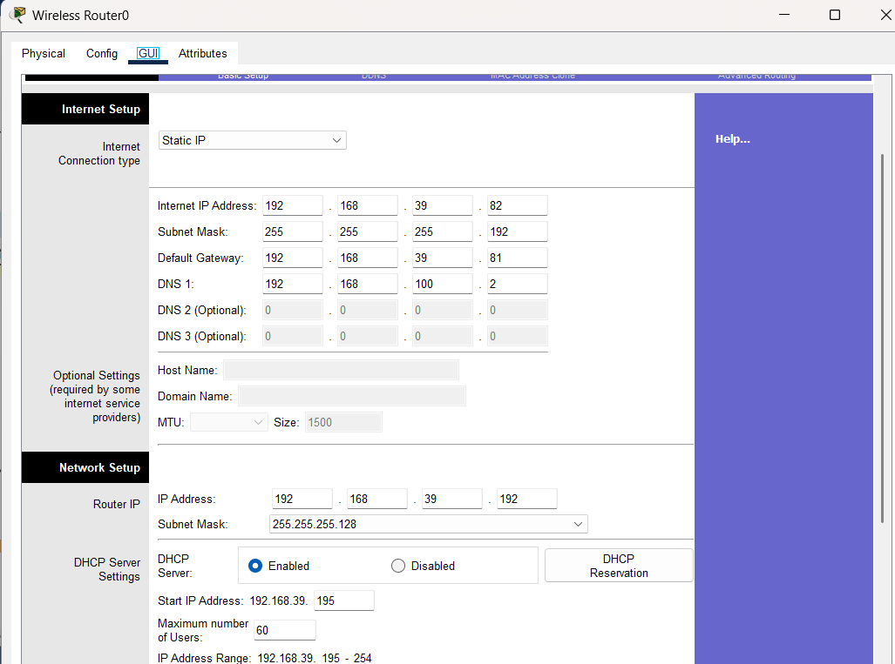

Configuración del SSID y SSID Broadcast
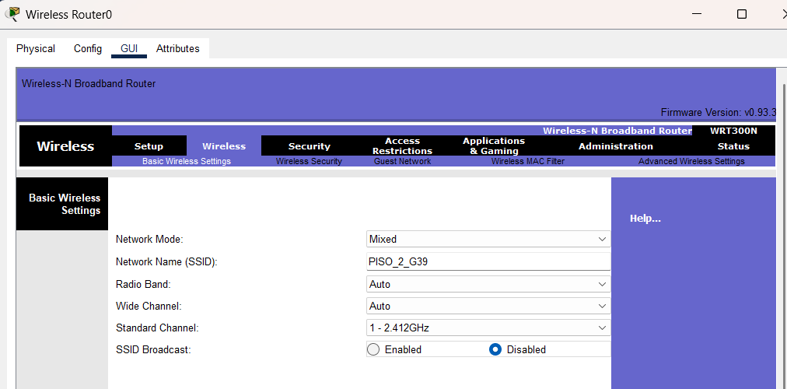

# RW1
Configuración del router e Internet
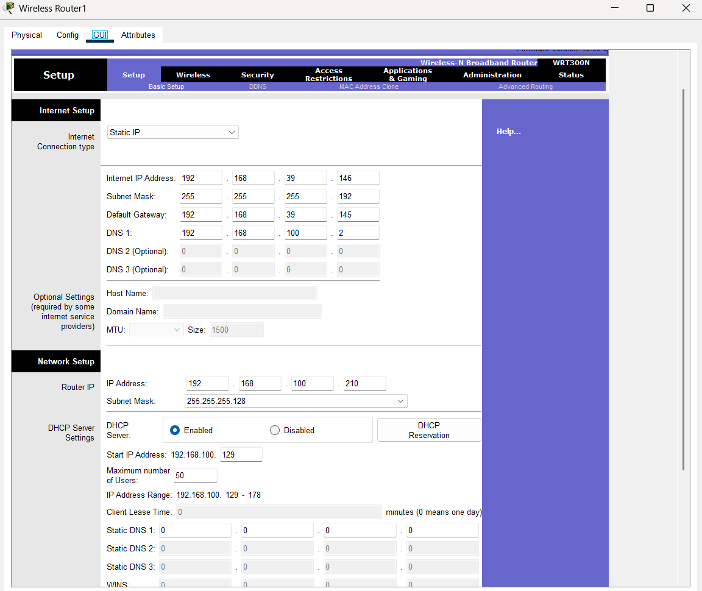

Configuración del SSID y SSID Broadcast
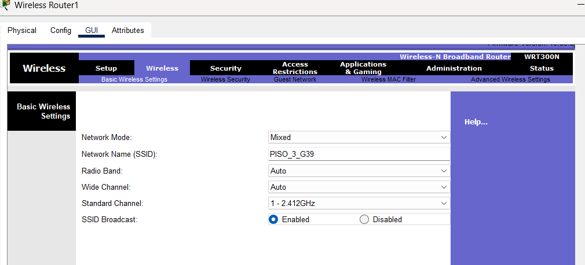

# SERVER DHCP
Configuración del Default Gateway y DNS Server
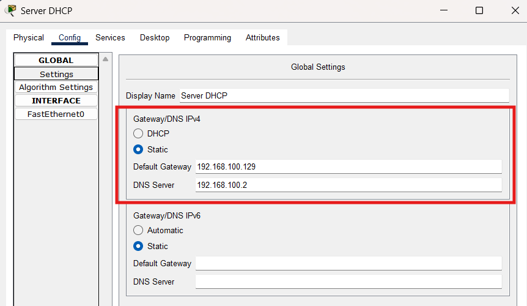

Configuración de la IP y Máscara de Subred
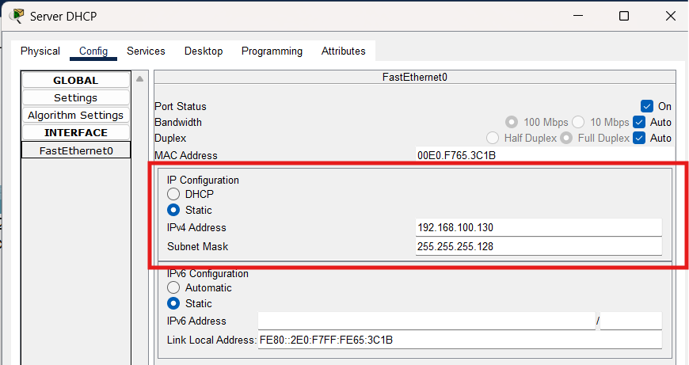

Creación de los Pools DHCP
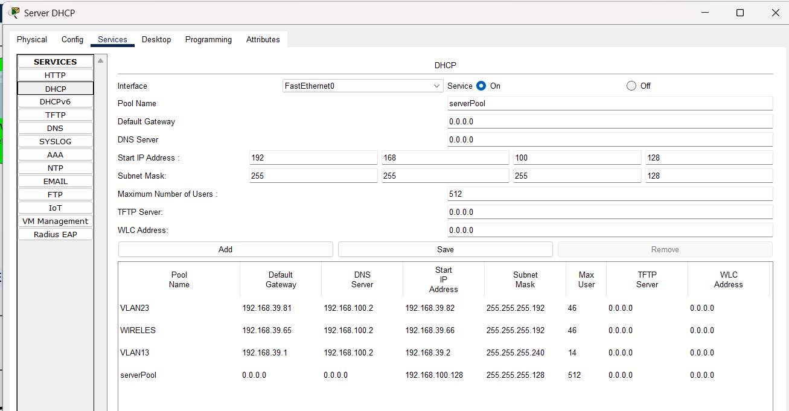

# SERVER WEB
Configuración del Default Gateway y DNS Server
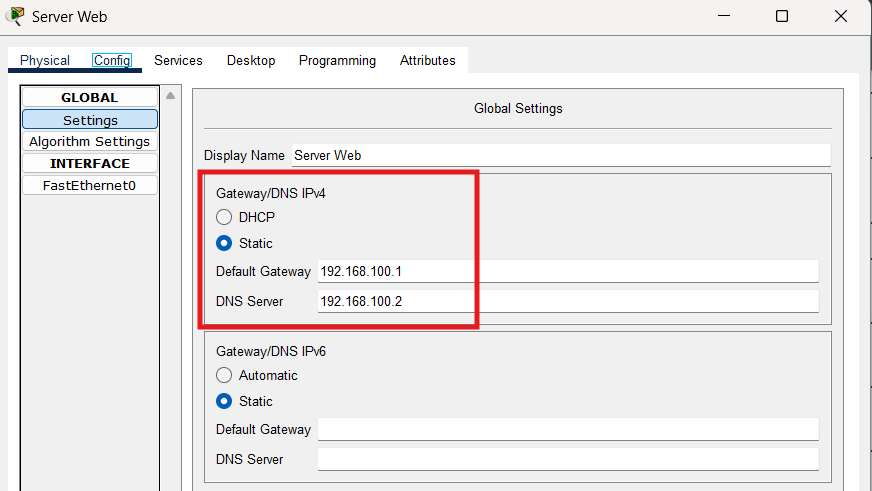

Configuración de la IP y Máscara de Subred
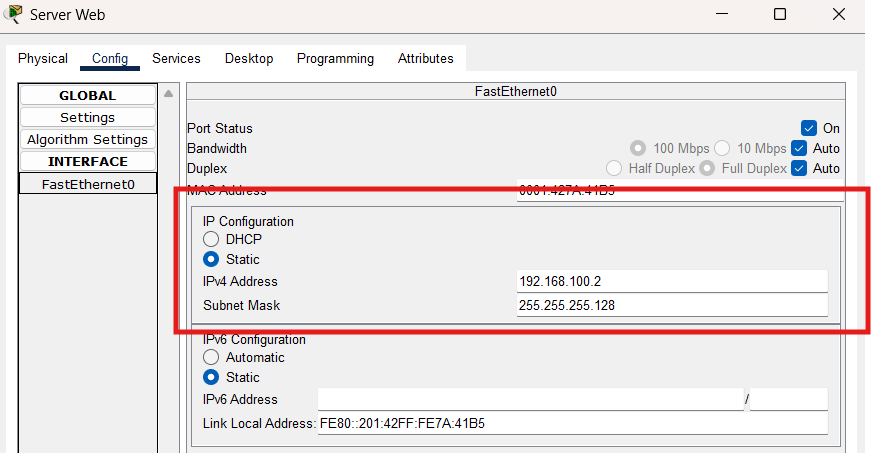

Configuración del DNS (Nombre e IP)
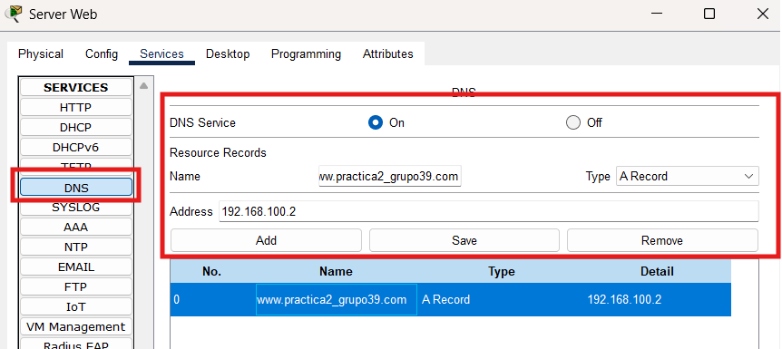

Configuración del Contenido DNS
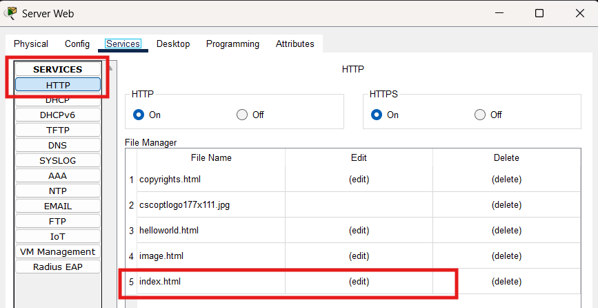
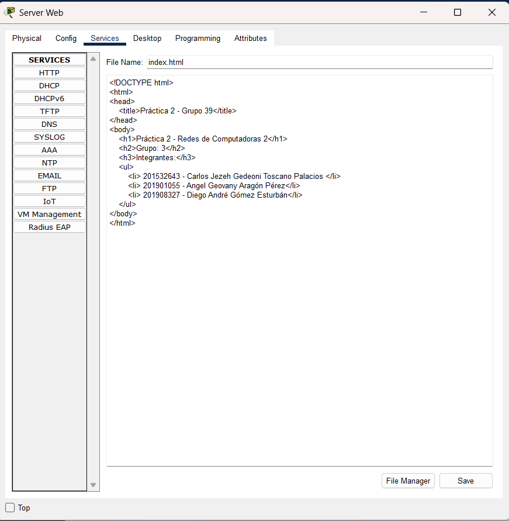
